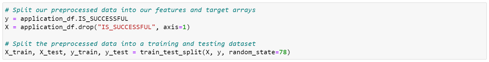
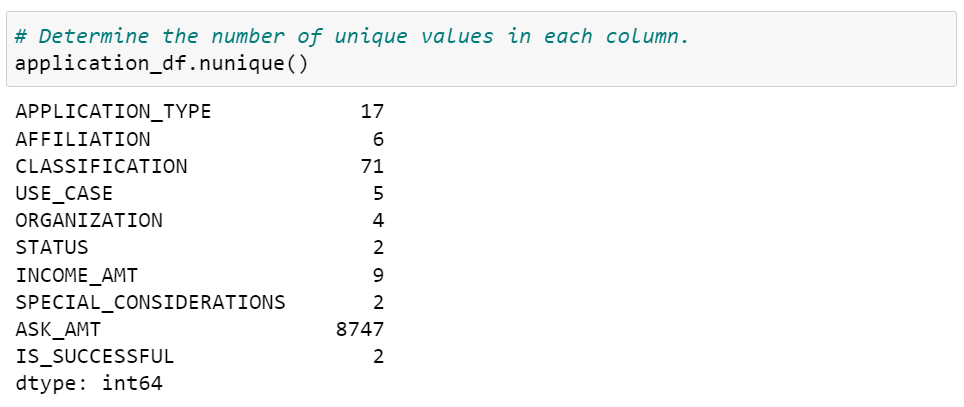
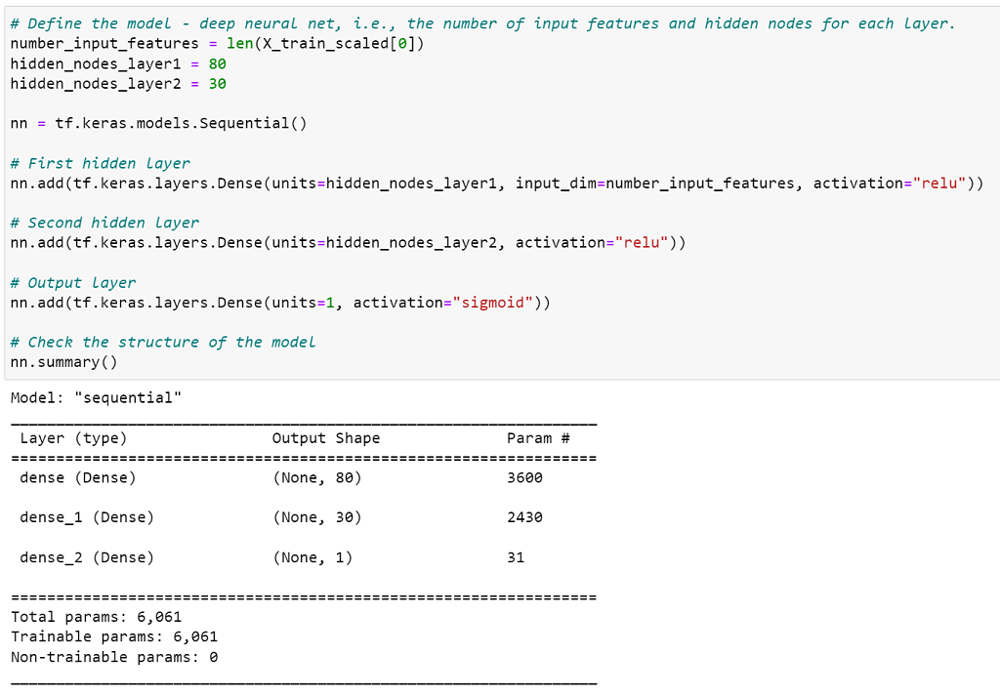
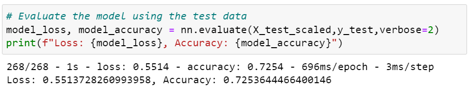

# Neural_Network_Charity_Analysis

# Purpose

Client needs help making predictions of where her foundation should make investments.Create a binary classifier capable ofpredicting whether applicants will be successful if Alphabet Soup funds them.

# Results

## Processing Data for a Neural Network Model

- ### What variable(s) are considered the target(s) for your model?

The "IS_SUCCESSFUL" category was the target variable for the model:
        

  
- ### What variable(s) are considered to be the features for your model?

 Original features included: 
 
    EIN,  NAME,  APPLICATION_TYPE,  AFFILIATION,  CLASSIFICATION, USE_CASE,  ORGANIZATION,  STATUS,  INCOME_AMT, SPECIAL_CONSIDERATIONS,  ASK_AMT,  IS_SUCCESSFUL
                      
- ### What variable(s) are neither targets nor features, and should be removed from the input data?

Removed EIN and NAME columns for this model.
          
 

## Compile, Train and Evaluate the Model / Optimize

- ### How many neurons, layers, and activation functions did you select for your neural network model, and why?

     -  Two hidden nodes lay within the first layer at 80 input/neurons.
     - 30 input/neurons are within the second layer.
     - Two total hidden layers and an output layer lay within this Neural Network                model, each containing activation functions: "relu" / "relu" and "sigmoid". 

- ### Were you able to achieve the target model performance?

The module did not meet the 75% target. The recorded accuracy was 72.5% with a loss of 55%.

- ### What steps did you take to try and increase model performance?

     - #### Attempt #1: 
        Removed additional variable "SPECIAL_CONSIDERATIONS", from                               the data set.
            
     - #### Attempt #2: 
        Amount of neurons were adjusted on layers. 
                     
          Ex: The first layer of neurons were adjusted to 100,                                     second to fifty, and third to twenty-five; while also adding "relu"                       activation to the third hidden layer.
           
     - #### Attempt3: 
        Changed "sigmoid" output layer to "tanh".
            
# Summary

The 75% accuracy was unfortunately unmet within the deep learning model. After attempting to optimize the model, the accuracy still failed to reach the 75% target. The new optimized results were only able to reach 72.5% - 72.8%.

However, the variables deem suitable for further research and optimization. For instance, "ASK_AMT" has 8,747 unique values. Bins for ranges could possibly be made regarding these unique values. If so, this could possibly decrease the amount of unique values and improve overall accuracy for the model.
